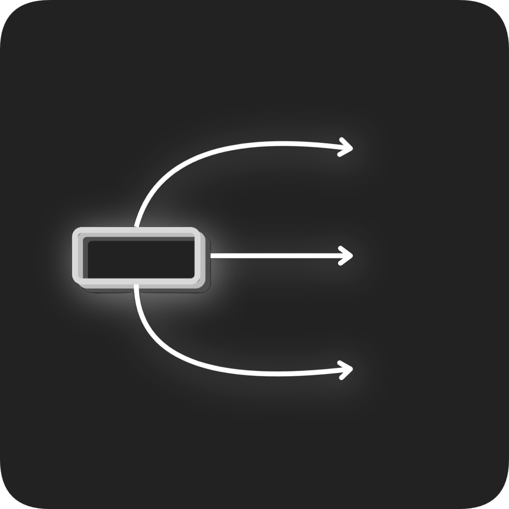
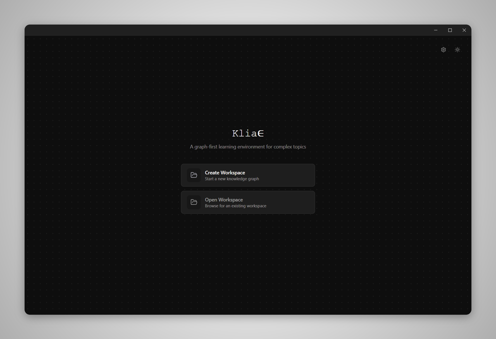
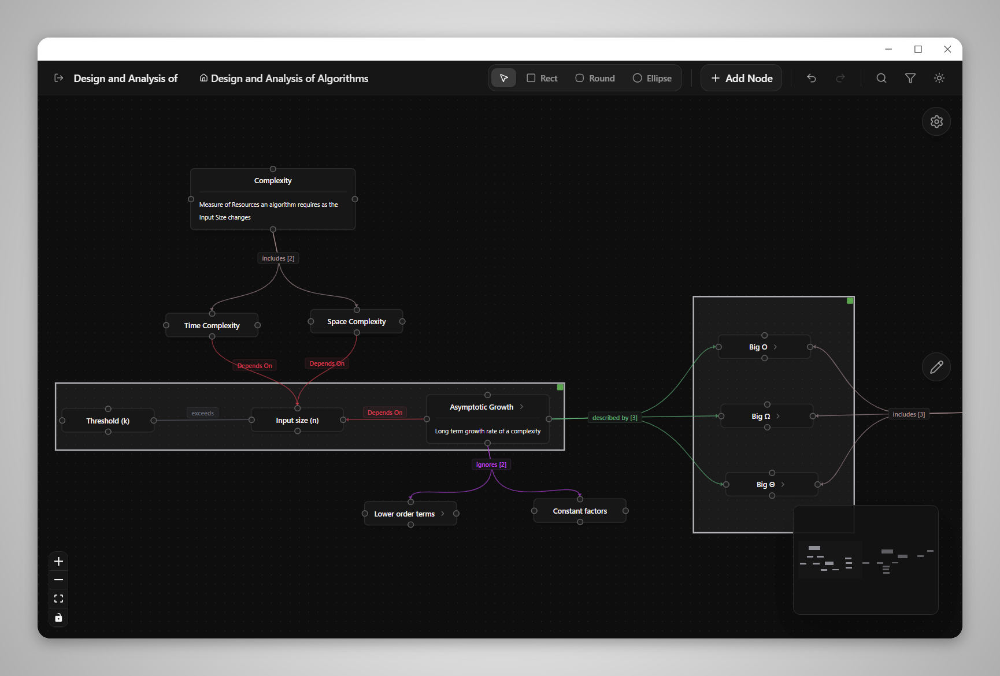
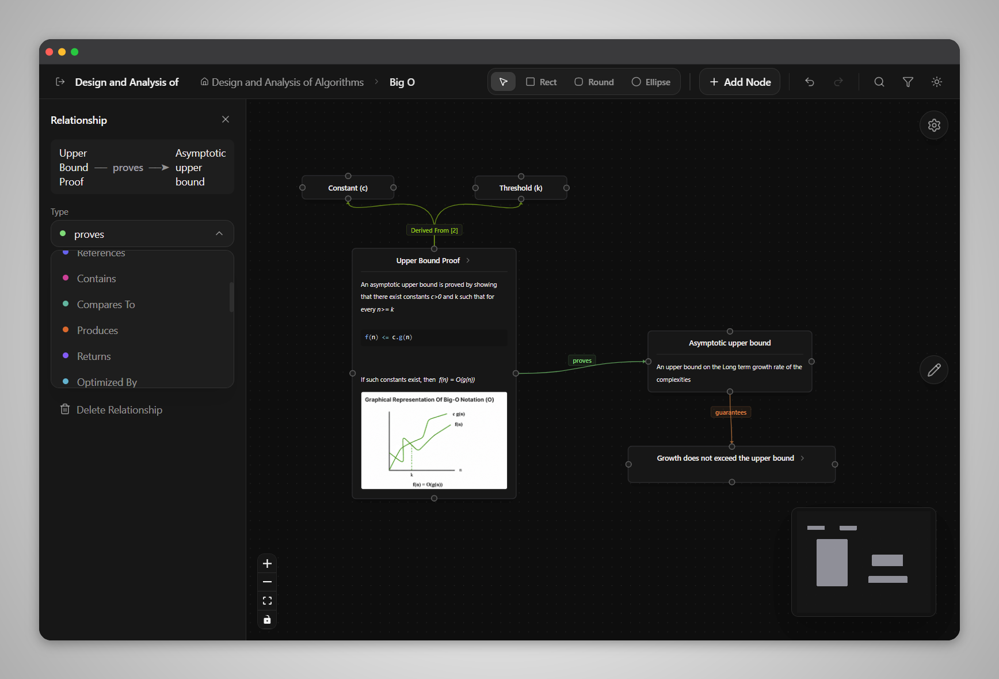

<p align="center">
  
</p>

<h1 align="center">Kliae</h1>

<p align="center">
  A graph-first learning environment
</p>

<p align="center">
  
  
  
  
</p>

---

Kliae lets you build interconnected knowledge graphs, break concepts into nested subgraphs, and document ideas with rich text, images, and code blocks, all on an infinite canvas, in a native desktop app.

## Screenshots

<p align="center">
  <br>
  <em>Welcome screen</em>
</p>

<p align="center">
  <br>
  <em>Graph canvas with nested nodes and relationships</em>
</p>

<p align="center">
  <br>
  <em>Relationship inspector and node detail view</em>
</p>

## Features

- Infinite graph canvas for building connected knowledge graphs
- Nested graphs for organizing concepts at multiple levels
- Rich text editor with formatting, images, and syntax-highlighted code blocks
- Built-in relationship types with support for custom relationship names
- Relationship filtering across the graph, with nested graph awareness
- Undo and redo for graph editing operations
- Canvas drawing tools for grouping and organizing content
- Native desktop application built with Tauri
- Dark and light themes

### Graph Editing
- Create, rename, move, resize, and delete nodes
- Multi-select nodes, and copy/paste them across the canvas
- Connect nodes using named relationships
- Double-click any node to open its own graph
- Clickable breadcrumbs for navigating nested graphs
- Infinite zoomable and pannable canvas
- Automatic fit-to-view when opening graphs

### Relationships
- Built-in types including Uses, Depends On, Implements, Explains, References, Contains, and more
- Custom relationship names that persist across sessions
- Relationship Inspector for editing relationship types and descriptions
- Color-coded relationships with unique arrowheads, directional arrows, and labels
- Per-workspace and app-wide default relationship color customization
- Bundle repeated relationships into a single labeled branch
- Filter the graph by relationship type
- Indicators for collapsed nodes containing matching relationships in nested graphs

### Node Content
- Rich text editor with bold, italic, underline, and strikethrough
- Bullet and numbered lists
- Syntax-highlighted code blocks
- Image support with full-screen preview
- View and edit mode toggle
- Automatic content saving while editing

### Canvas Tools
- Rectangle, rounded rectangle, and ellipse drawing tools
- Draw directly on the canvas
- Move and resize shapes
- Group nodes inside canvas containers
- Add labels to canvas shapes

### Workspace
- Create and open workspaces
- Recent workspace list
- Automatic file persistence
- Individual JSON files for nodes, edges, and graphs

### User Experience
- Dark and light themes
- Keyboard shortcuts for common actions, with editing fields excluded so shortcuts never interrupt typing
- In-app updater that notifies you when a new version is available
- Command Palette
- Context menus
- Responsive desktop interface
- Zoom controls and minimap

> This is an early beta release. Core functionality is complete, but you may run into bugs or UI inconsistencies. Feedback and bug reports are greatly appreciated.

## Installation

Download the latest build for your platform from the [Releases page](https://github.com/Kushal2205a/Kliae/releases/latest).

| Platform | Format |
|---|---|
| Windows | `.exe` installer, `.msi` |
| macOS | `.dmg` (Intel and Apple Silicon) |
| Linux | `.AppImage`, `.deb`, `.rpm`, `.tar.gz` |

Each release also ships a `.sig` signature file alongside the binary for verification.

## Tech Stack

| Layer | Technology |
|---|---|
| Desktop shell | [Tauri 2](https://tauri.app) |
| UI | [React 19](https://react.dev), [TypeScript](https://www.typescriptlang.org) |
| Build tool | [Vite](https://vite.dev) |
| State management | [Zustand](https://github.com/pmndrs/zustand) |
| Graph canvas | [@xyflow/react (React Flow)](https://reactflow.dev) |
| Rich text editor | [Lexical](https://lexical.dev) |
| Styling | [Tailwind CSS 4](https://tailwindcss.com) |
| Icons | [Lucide](https://lucide.dev) |
| Linting | [oxlint](https://oxc.rs) |

**Tauri plugins used:** dialog, fs, process, and updater, for native file dialogs, filesystem access, process control, and the in-app update checker.
## Building from Source

### Prerequisites

- [Node.js](https://nodejs.org) (LTS version)
- [pnpm](https://pnpm.io)
- [Rust](https://www.rust-lang.org/tools/install) and Cargo
- Platform-specific Tauri dependencies:
  - **Windows**: [Microsoft C++ Build Tools](https://visualstudio.microsoft.com/visual-cpp-build-tools/) and WebView2 (preinstalled on Windows 10/11)
  - **macOS**: Xcode Command Line Tools (`xcode-select --install`)
  - **Linux**: `webkit2gtk-4.1`, `libayatana-appindicator3`, `librsvg2`, and build essentials. See the [Tauri Linux prerequisites guide](https://tauri.app/start/prerequisites/) for your distro's exact packages.

### Steps

1. Clone the repository
   ```bash
   git clone https://github.com/Kushal2205a/Kliae.git
   cd Kliae
   ```

2. Install dependencies
   ```bash
   pnpm install
   ```

3. Run in development mode
   ```bash
   pnpm tauri dev
   ```

4. Build a production bundle for your platform
   ```bash
   pnpm tauri build
   ```

The compiled binaries and installers will be in `src-tauri/target/release/bundle/`.

## License

Kliae is licensed under the [MIT License](LICENSE).

## Feedback

This is a public beta. Bug reports, feature requests, and general feedback are welcome via [Issues](https://github.com/Kushal2205a/Kliae/issues).